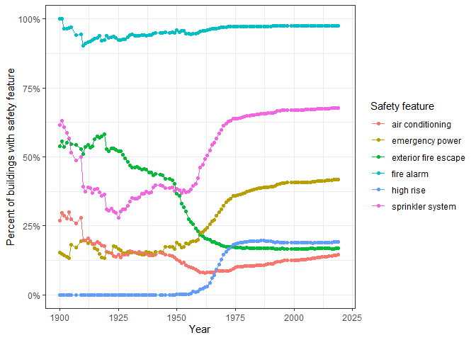

Mini Data-Analysis Deliverable 2
================
Shannon Edie
14/10/2021

*To complete this milestone, you can either edit [this `.rmd`
file](https://raw.githubusercontent.com/UBC-STAT/stat545.stat.ubc.ca/master/content/mini-project/mini-project-2.Rmd)
directly. Fill in the sections that are commented out with
`<!--- start your work here--->`. When you are done, make sure to knit
to an `.md` file by changing the output in the YAML header to
`github_document`, before submitting a tagged release on canvas.*

# Welcome back to your mini data analysis project!

This time, we will explore more in depth the concept of *tidy data*, and
hopefully investigate further into your research questions that you
defined in milestone 1.

**NOTE**: The main purpose of the mini data analysis is to integrate
what you learn in class in an analysis. Although each milestone provides
a framework for you to conduct your analysis, it’s possible that you
might find the instructions too rigid for your data set. If this is the
case, you may deviate from the instructions – just make sure you’re
demonstrating a wide range of tools and techniques taught in this class.

Begin by loading your data and the tidyverse package below:

``` r
library(datateachr) # <- might contain the data you picked!
library(tidyverse)
```

    ## Warning: package 'tidyverse' was built under R version 4.1.1

``` r
library(knitr) # for nicely printed out tables
library(gt) # nicely printed tables
```

    ## Warning: package 'gt' was built under R version 4.1.1

# Learning Objectives

By the end of this milestone, you should:

-   Become familiar with manipulating and summarizing your data in
    tibbles using `dplyr` and `tidyr`, with a research question in mind.
-   Understand what *tidy* data is, and how to create it. In milestone
    3, we will explore when this might be useful.
-   Generate a reproducible and clear report using R Markdown.
-   Gain a greater understanding of how to use R to answer research
    questions about your data.

**Things to keep in mind**

-   Remember to document your code, be explicit about what you are
    doing, and write notes in this markdown document when you feel that
    context is required. Create your analysis as if someone else will be
    reading it! **There will be 2.5 points reserved for reproducibility,
    readability, and repo organization.**

-   Before working on each task, you should always keep in mind the
    specific **research question** that you’re trying to answer.

# Task 1: Process and summarize your data (15 points)

From milestone 1, you should have an idea of the basic structure of your
dataset (e.g. number of rows and columns, class types, etc.). Here, we
will start investigating your data more in-depth using various data
manipulation functions.

### 1.1 (2.5 points)

First, write out the 4 research questions you defined in milestone 1
were. This will guide your work through milestone 2:

<!-------------------------- Start your work below ---------------------------->

1.  Is the accessibility of a unit associated with the ward in which the
    building exists?
2.  Have the accessibility features for apartment buildings increased
    over time?
3.  Is the safety of an apartment building associated with the ward in
    which the building exists?
4.  Have the safety features for apartment buildings in Toronto
    increased over time?

The two characteristics, safety and accessibility, can be quantified by
several variables in the dataset:

1.  Accessibility (e.g. barrier-free entrance, intercom, number of
    accessible parking spaces, number of elevators, number of
    barrier-free accessible units)

2.  Safety (exterior fire escape, fire alarm, sprinkler system,
    emergency power, air conditioning, heating type)

Before processing, I can reduce my dataset to only include the variables
that I will be interested in for this analysis.

``` r
apt_buildings <- apt_buildings %>%
  # There's also one apartment building in ward "YY"-- let's remove that building
  filter(ward!="YY") %>%
  # Let's define the wards in terms of the communities they are in (from Toronto district ward & community identifier online)
  mutate(community = ifelse(as.numeric(ward) %in% c(1:7, 11:13, 17),
                                "Etobicoke",
                         ifelse(as.numeric(ward) %in% c(14, 18:22, 27:32), 
                                "Toronto East York",
                         ifelse(as.numeric(ward) %in% c(8:10, 15:16, 23:26, 33:34),
                                "North York",
                         ifelse(as.numeric(ward) %in% c(35:44),
                                "Scarborough", ward
                                )))))


safety <- apt_buildings %>%
  select(
    # Select safety variables
    fire_alarm, exterior_fire_escape, sprinkler_system, 
    emergency_power, air_conditioning, 
    
    # Select grouping variables
    ward, community, year_built, no_of_storeys, no_of_units
    ) %>%
  # Let's also simplify air conditioning so we just have whether the
  # building has air conditioning or not.
  mutate(air_conditioning = ifelse(air_conditioning=="NONE", "NO",
                            ifelse(is.na(air_conditioning), NA, "YES")))

accessibility <- apt_buildings %>%
  select(
    # Select accessibility variables
    barrier_free_accessibilty_entr, no_of_elevators, intercom,
    no_of_accessible_parking_spaces, no_barrier_free_accessible_units,
    
    # Select grouping variables
    ward, community, year_built, no_of_storeys, no_of_units
    )
```

<!----------------------------------------------------------------------------->

### 1.2 (10 points)

Now, for each of your four research questions, choose one task from
options 1-4 (summarizing), and one other task from 4-8 (graphing). You
should have 2 tasks done for each research question (8 total). Make sure
it makes sense to do them! (e.g. don’t use a numerical variables for a
task that needs a categorical variable.). Comment on why each task helps
(or doesn’t!) answer the corresponding research question.

Ensure that the output of each operation is printed!

**Summarizing:**

1.  Compute the *range*, *mean*, and *two other summary statistics* of
    **one numerical variable** across the groups of **one categorical
    variable** from your data.
2.  Compute the number of observations for at least one of your
    categorical variables. Do not use the function `table()`!
3.  Create a categorical variable with 3 or more groups from an existing
    numerical variable. You can use this new variable in the other
    tasks! *An example: age in years into “child, teen, adult, senior”.*
4.  Based on two categorical variables, calculate two summary statistics
    of your choosing.

**Graphing:**

5.  Create a graph out of summarized variables that has at least two
    geom layers.
6.  Create a graph of your choosing, make one of the axes logarithmic,
    and format the axes labels so that they are “pretty” or easier to
    read.
7.  Make a graph where it makes sense to customize the alpha
    transparency.
8.  Create 3 histograms out of summarized variables, with each histogram
    having different sized bins. Pick the “best” one and explain why it
    is the best.

Make sure it’s clear what research question you are doing each operation
for!

<!------------------------- Start your work below ----------------------------->

# Research question \#1

1.  Is the accessibility of a unit associated with the ward/community in
    which the building exists?

For a summary for Research Question 1, I looked at counts (summary
strategy 2) for each of the yes/no accessibility attributes. This format
could be useful to set up for a chi-squared test to determine whether
there is a relationship between the communities and the attributes. This
strategy could be taken for each ward, as well, but for the purposes of
display, I left it as per community.

``` r
# Compute the number of observations for one of my categorical variables
# Let's also divide by ward
accessibility %>%
  mutate(`Elevators`= ifelse(no_of_elevators==0 & no_of_storeys > 0, "No",
                      ifelse(no_of_storeys==0, "Yes", "Yes")),
         `Accessible parking`=ifelse(no_of_accessible_parking_spaces==0, "no", "yes"))%>%
  # Rename the existing binary variables to be a little nicer
  rename(`Barrier-free entrance`=barrier_free_accessibilty_entr,
         Intercom=intercom) %>%
  select(community, ward, Elevators, `Accessible parking`, `Barrier-free entrance`, Intercom) %>%
  group_by(community) %>%
  pivot_longer(cols=Elevators:Intercom) %>%
  # Get counts for each of the yes/no safety features within each community
  count(name, value) %>%
  # Let's also make the YES/NO/NA labels lowercase
  mutate(value=tolower(value)) %>%
  group_by(community, name) %>%
  # Pivot so it's in a table shape
  pivot_wider(id_cols = c("community"), names_from = c(name, value), values_from = n) %>%
# Now print out nicely using gt()
gt(rowname_col="community",
   groupname_col=NULL) %>%
  # Format so the variable name is the column spanner
  tab_spanner_delim(delim="_",
                    columns=c(-community)) %>%
  tab_header(
    title = "", 
    subtitle=md("\\label{rq1.summary.table} The number of buildings in each community with three metrics of accessibility: (1) whether or not the building has any accessible parking; (2) whether or not the building has a barrier-free entrance; and (3) whether or not the building has elevators. Note that if the building only has a main storey but they do not have an elevator, then the building is still identified as 'having an elevator'."))
```

<div id="acqdmyktsn" style="overflow-x:auto;overflow-y:auto;width:auto;height:auto;">
<style>html {
  font-family: -apple-system, BlinkMacSystemFont, 'Segoe UI', Roboto, Oxygen, Ubuntu, Cantarell, 'Helvetica Neue', 'Fira Sans', 'Droid Sans', Arial, sans-serif;
}

#acqdmyktsn .gt_table {
  display: table;
  border-collapse: collapse;
  margin-left: auto;
  margin-right: auto;
  color: #333333;
  font-size: 16px;
  font-weight: normal;
  font-style: normal;
  background-color: #FFFFFF;
  width: auto;
  border-top-style: solid;
  border-top-width: 2px;
  border-top-color: #A8A8A8;
  border-right-style: none;
  border-right-width: 2px;
  border-right-color: #D3D3D3;
  border-bottom-style: solid;
  border-bottom-width: 2px;
  border-bottom-color: #A8A8A8;
  border-left-style: none;
  border-left-width: 2px;
  border-left-color: #D3D3D3;
}

#acqdmyktsn .gt_heading {
  background-color: #FFFFFF;
  text-align: center;
  border-bottom-color: #FFFFFF;
  border-left-style: none;
  border-left-width: 1px;
  border-left-color: #D3D3D3;
  border-right-style: none;
  border-right-width: 1px;
  border-right-color: #D3D3D3;
}

#acqdmyktsn .gt_title {
  color: #333333;
  font-size: 125%;
  font-weight: initial;
  padding-top: 4px;
  padding-bottom: 4px;
  border-bottom-color: #FFFFFF;
  border-bottom-width: 0;
}

#acqdmyktsn .gt_subtitle {
  color: #333333;
  font-size: 85%;
  font-weight: initial;
  padding-top: 0;
  padding-bottom: 6px;
  border-top-color: #FFFFFF;
  border-top-width: 0;
}

#acqdmyktsn .gt_bottom_border {
  border-bottom-style: solid;
  border-bottom-width: 2px;
  border-bottom-color: #D3D3D3;
}

#acqdmyktsn .gt_col_headings {
  border-top-style: solid;
  border-top-width: 2px;
  border-top-color: #D3D3D3;
  border-bottom-style: solid;
  border-bottom-width: 2px;
  border-bottom-color: #D3D3D3;
  border-left-style: none;
  border-left-width: 1px;
  border-left-color: #D3D3D3;
  border-right-style: none;
  border-right-width: 1px;
  border-right-color: #D3D3D3;
}

#acqdmyktsn .gt_col_heading {
  color: #333333;
  background-color: #FFFFFF;
  font-size: 100%;
  font-weight: normal;
  text-transform: inherit;
  border-left-style: none;
  border-left-width: 1px;
  border-left-color: #D3D3D3;
  border-right-style: none;
  border-right-width: 1px;
  border-right-color: #D3D3D3;
  vertical-align: bottom;
  padding-top: 5px;
  padding-bottom: 6px;
  padding-left: 5px;
  padding-right: 5px;
  overflow-x: hidden;
}

#acqdmyktsn .gt_column_spanner_outer {
  color: #333333;
  background-color: #FFFFFF;
  font-size: 100%;
  font-weight: normal;
  text-transform: inherit;
  padding-top: 0;
  padding-bottom: 0;
  padding-left: 4px;
  padding-right: 4px;
}

#acqdmyktsn .gt_column_spanner_outer:first-child {
  padding-left: 0;
}

#acqdmyktsn .gt_column_spanner_outer:last-child {
  padding-right: 0;
}

#acqdmyktsn .gt_column_spanner {
  border-bottom-style: solid;
  border-bottom-width: 2px;
  border-bottom-color: #D3D3D3;
  vertical-align: bottom;
  padding-top: 5px;
  padding-bottom: 5px;
  overflow-x: hidden;
  display: inline-block;
  width: 100%;
}

#acqdmyktsn .gt_group_heading {
  padding: 8px;
  color: #333333;
  background-color: #FFFFFF;
  font-size: 100%;
  font-weight: initial;
  text-transform: inherit;
  border-top-style: solid;
  border-top-width: 2px;
  border-top-color: #D3D3D3;
  border-bottom-style: solid;
  border-bottom-width: 2px;
  border-bottom-color: #D3D3D3;
  border-left-style: none;
  border-left-width: 1px;
  border-left-color: #D3D3D3;
  border-right-style: none;
  border-right-width: 1px;
  border-right-color: #D3D3D3;
  vertical-align: middle;
}

#acqdmyktsn .gt_empty_group_heading {
  padding: 0.5px;
  color: #333333;
  background-color: #FFFFFF;
  font-size: 100%;
  font-weight: initial;
  border-top-style: solid;
  border-top-width: 2px;
  border-top-color: #D3D3D3;
  border-bottom-style: solid;
  border-bottom-width: 2px;
  border-bottom-color: #D3D3D3;
  vertical-align: middle;
}

#acqdmyktsn .gt_from_md > :first-child {
  margin-top: 0;
}

#acqdmyktsn .gt_from_md > :last-child {
  margin-bottom: 0;
}

#acqdmyktsn .gt_row {
  padding-top: 8px;
  padding-bottom: 8px;
  padding-left: 5px;
  padding-right: 5px;
  margin: 10px;
  border-top-style: solid;
  border-top-width: 1px;
  border-top-color: #D3D3D3;
  border-left-style: none;
  border-left-width: 1px;
  border-left-color: #D3D3D3;
  border-right-style: none;
  border-right-width: 1px;
  border-right-color: #D3D3D3;
  vertical-align: middle;
  overflow-x: hidden;
}

#acqdmyktsn .gt_stub {
  color: #333333;
  background-color: #FFFFFF;
  font-size: 100%;
  font-weight: initial;
  text-transform: inherit;
  border-right-style: solid;
  border-right-width: 2px;
  border-right-color: #D3D3D3;
  padding-left: 12px;
}

#acqdmyktsn .gt_summary_row {
  color: #333333;
  background-color: #FFFFFF;
  text-transform: inherit;
  padding-top: 8px;
  padding-bottom: 8px;
  padding-left: 5px;
  padding-right: 5px;
}

#acqdmyktsn .gt_first_summary_row {
  padding-top: 8px;
  padding-bottom: 8px;
  padding-left: 5px;
  padding-right: 5px;
  border-top-style: solid;
  border-top-width: 2px;
  border-top-color: #D3D3D3;
}

#acqdmyktsn .gt_grand_summary_row {
  color: #333333;
  background-color: #FFFFFF;
  text-transform: inherit;
  padding-top: 8px;
  padding-bottom: 8px;
  padding-left: 5px;
  padding-right: 5px;
}

#acqdmyktsn .gt_first_grand_summary_row {
  padding-top: 8px;
  padding-bottom: 8px;
  padding-left: 5px;
  padding-right: 5px;
  border-top-style: double;
  border-top-width: 6px;
  border-top-color: #D3D3D3;
}

#acqdmyktsn .gt_striped {
  background-color: rgba(128, 128, 128, 0.05);
}

#acqdmyktsn .gt_table_body {
  border-top-style: solid;
  border-top-width: 2px;
  border-top-color: #D3D3D3;
  border-bottom-style: solid;
  border-bottom-width: 2px;
  border-bottom-color: #D3D3D3;
}

#acqdmyktsn .gt_footnotes {
  color: #333333;
  background-color: #FFFFFF;
  border-bottom-style: none;
  border-bottom-width: 2px;
  border-bottom-color: #D3D3D3;
  border-left-style: none;
  border-left-width: 2px;
  border-left-color: #D3D3D3;
  border-right-style: none;
  border-right-width: 2px;
  border-right-color: #D3D3D3;
}

#acqdmyktsn .gt_footnote {
  margin: 0px;
  font-size: 90%;
  padding: 4px;
}

#acqdmyktsn .gt_sourcenotes {
  color: #333333;
  background-color: #FFFFFF;
  border-bottom-style: none;
  border-bottom-width: 2px;
  border-bottom-color: #D3D3D3;
  border-left-style: none;
  border-left-width: 2px;
  border-left-color: #D3D3D3;
  border-right-style: none;
  border-right-width: 2px;
  border-right-color: #D3D3D3;
}

#acqdmyktsn .gt_sourcenote {
  font-size: 90%;
  padding: 4px;
}

#acqdmyktsn .gt_left {
  text-align: left;
}

#acqdmyktsn .gt_center {
  text-align: center;
}

#acqdmyktsn .gt_right {
  text-align: right;
  font-variant-numeric: tabular-nums;
}

#acqdmyktsn .gt_font_normal {
  font-weight: normal;
}

#acqdmyktsn .gt_font_bold {
  font-weight: bold;
}

#acqdmyktsn .gt_font_italic {
  font-style: italic;
}

#acqdmyktsn .gt_super {
  font-size: 65%;
}

#acqdmyktsn .gt_footnote_marks {
  font-style: italic;
  font-weight: normal;
  font-size: 65%;
}
</style>
<table class="gt_table">
  <thead class="gt_header">
    <tr>
      <th colspan="13" class="gt_heading gt_title gt_font_normal" style></th>
    </tr>
    <tr>
      <th colspan="13" class="gt_heading gt_subtitle gt_font_normal gt_bottom_border" style>\label{rq1.summary.table} The number of buildings in each community with three metrics of accessibility: (1) whether or not the building has any accessible parking; (2) whether or not the building has a barrier-free entrance; and (3) whether or not the building has elevators. Note that if the building only has a main storey but they do not have an elevator, then the building is still identified as 'having an elevator'.</th>
    </tr>
  </thead>
  <thead class="gt_col_headings">
    <tr>
      <th class="gt_col_heading gt_columns_bottom_border gt_left" rowspan="2" colspan="1"></th>
      <th class="gt_center gt_columns_top_border gt_column_spanner_outer" rowspan="1" colspan="3">
        <span class="gt_column_spanner">Accessible parking</span>
      </th>
      <th class="gt_center gt_columns_top_border gt_column_spanner_outer" rowspan="1" colspan="3">
        <span class="gt_column_spanner">Barrier-free entrance</span>
      </th>
      <th class="gt_center gt_columns_top_border gt_column_spanner_outer" rowspan="1" colspan="3">
        <span class="gt_column_spanner">Elevators</span>
      </th>
      <th class="gt_center gt_columns_top_border gt_column_spanner_outer" rowspan="1" colspan="3">
        <span class="gt_column_spanner">Intercom</span>
      </th>
    </tr>
    <tr>
      <th class="gt_col_heading gt_columns_bottom_border gt_right" rowspan="1" colspan="1">no</th>
      <th class="gt_col_heading gt_columns_bottom_border gt_right" rowspan="1" colspan="1">yes</th>
      <th class="gt_col_heading gt_columns_bottom_border gt_right" rowspan="1" colspan="1">NA</th>
      <th class="gt_col_heading gt_columns_bottom_border gt_right" rowspan="1" colspan="1">no</th>
      <th class="gt_col_heading gt_columns_bottom_border gt_right" rowspan="1" colspan="1">yes</th>
      <th class="gt_col_heading gt_columns_bottom_border gt_right" rowspan="1" colspan="1">NA</th>
      <th class="gt_col_heading gt_columns_bottom_border gt_right" rowspan="1" colspan="1">no</th>
      <th class="gt_col_heading gt_columns_bottom_border gt_right" rowspan="1" colspan="1">yes</th>
      <th class="gt_col_heading gt_columns_bottom_border gt_right" rowspan="1" colspan="1">NA</th>
      <th class="gt_col_heading gt_columns_bottom_border gt_right" rowspan="1" colspan="1">no</th>
      <th class="gt_col_heading gt_columns_bottom_border gt_right" rowspan="1" colspan="1">yes</th>
      <th class="gt_col_heading gt_columns_bottom_border gt_right" rowspan="1" colspan="1">NA</th>
    </tr>
  </thead>
  <tbody class="gt_table_body">
    <tr><td class="gt_row gt_left gt_stub">Etobicoke</td>
<td class="gt_row gt_right">924</td>
<td class="gt_row gt_right">954</td>
<td class="gt_row gt_right">75</td>
<td class="gt_row gt_right">1208</td>
<td class="gt_row gt_right">694</td>
<td class="gt_row gt_right">51</td>
<td class="gt_row gt_right">800</td>
<td class="gt_row gt_right">1151</td>
<td class="gt_row gt_right">2</td>
<td class="gt_row gt_right">87</td>
<td class="gt_row gt_right">1810</td>
<td class="gt_row gt_right">56</td></tr>
    <tr><td class="gt_row gt_left gt_stub">North York</td>
<td class="gt_row gt_right">370</td>
<td class="gt_row gt_right">424</td>
<td class="gt_row gt_right">21</td>
<td class="gt_row gt_right">450</td>
<td class="gt_row gt_right">351</td>
<td class="gt_row gt_right">14</td>
<td class="gt_row gt_right">282</td>
<td class="gt_row gt_right">533</td>
<td class="gt_row gt_right">NA</td>
<td class="gt_row gt_right">25</td>
<td class="gt_row gt_right">773</td>
<td class="gt_row gt_right">17</td></tr>
    <tr><td class="gt_row gt_left gt_stub">Toronto East York</td>
<td class="gt_row gt_right">286</td>
<td class="gt_row gt_right">373</td>
<td class="gt_row gt_right">27</td>
<td class="gt_row gt_right">376</td>
<td class="gt_row gt_right">293</td>
<td class="gt_row gt_right">17</td>
<td class="gt_row gt_right">255</td>
<td class="gt_row gt_right">431</td>
<td class="gt_row gt_right">NA</td>
<td class="gt_row gt_right">34</td>
<td class="gt_row gt_right">635</td>
<td class="gt_row gt_right">17</td></tr>
  </tbody>
  
  
</table>
</div>

For the visualization, I looked at the breakdown of the percent of
barrier-free units per building, separated by whether or not the
building had a barrier-free entrance (Figure ). I used a log-10 scale of
the y-axis (graphing strategy 6) to visualize the data better. The
communities look relatively comparable. What is interesting though is
that buildings without a barrier-free entrance appear to have a similar
percentage of barrier-free units to buildings that have a barrier-free
entrance.

``` r
accessibility %>%
  arrange(community) %>%
ggplot() +
  geom_boxplot(aes(x=community,
                   # Add 1 to allow for log-transform
                   y=(no_barrier_free_accessible_units+1)/no_of_units,
           fill=barrier_free_accessibilty_entr)) +
  theme_bw() +
  ylab("Percent of units that are 'barrier-free'") + xlab("Community") +
  scale_fill_discrete(name="Barrier free accessibility entrance?") +
  scale_y_log10()
```

    ## Warning: Removed 154 rows containing non-finite values (stat_boxplot).


# Research question \#2

2.  Have the accessibility features for apartment buildings increased
    over time?

For the summarising step, I began by defining a new categorical variable
with three categories (summary strategy 3) based on the number of
elevators, as well as the number of storeys: \* If the building was only
one floor, then I labelled the building as not needing an elevator. \*
If the building had several storeys and had no elevators, then I
labelled the building as needing but not having an elevator. \* If the
building had several storeys and at least one elevator, then I labelled
the building as needing and having an elevator.

``` r
accessibility.rq2 <- accessibility %>%
  # Create a numerical variable with t or more groups
  mutate(`Elevators`= ifelse(no_of_elevators==0 & no_of_storeys > 0, "No",
                      ifelse(no_of_storeys==0, "Not needed", "Yes")),
         `Accessible parking`=ifelse(no_of_accessible_parking_spaces==0, "no", "yes"),
         )
```

For the graphical step, I looked at the total percentage of buildings
over time that had each of the accessibility features I was considering,
now including whether or not the building had an elevator, if needed
(Figure ). I used two different geom layers to add both lines and points
to this graph (graphing strategy 5). Surprisingly, intercoms were
present in most buildings even since the 1970’s. Elevators appeared to
make a fast entrance into the apartment building scene, but this could
be due to the rising number of high-rise buildings. This theory requires
further research. The rate at which barrier-free entrances and
accessible parking have increased in prevalence appears to be relatively
similar.

``` r
accessibility.rq2 %>%
  # Rename the existing binary variables to be a little nicer
  rename(`Barrier-free entrance`=barrier_free_accessibilty_entr,
         Intercom=intercom) %>%
  group_by(year_built) %>%
  # Get counts of each variable for each year
  summarise_at(c("Barrier-free entrance", "Intercom", 
              "Accessible parking", "Elevators"),
            list("YES"=function(x){sum(toupper(x)=="YES", na.rm=T)},
                 "NO"=function(x){sum(toupper(x)=="NO", na.rm=T)},
                 "None"=function(x){sum(is.na(x), na.rm=T)})) %>%
  # Calculate cumulative sums throughout the years
  ungroup() %>% arrange(year_built) %>%
  mutate_at(names(.)[-1], cumsum) %>%
  pivot_longer(names(.)[-1], 
               names_to=c("variable", ".value"),
               names_pattern="(.*)_([^_]*$)") %>%
  mutate(percent_yes = YES / (YES + NO + None)) %>%
ggplot() +
  geom_point(aes(x=year_built, y=percent_yes, col=variable)) +
  geom_line(aes(x=year_built, y=percent_yes, col=variable)) +
  xlim(c(1900,2020)) +
  xlab("Year") + ylab("Percent of buildings with accessibility feature") +
  scale_color_discrete(name="Accessibility feature") +
  theme_bw() +
  scale_y_continuous(labels = scales::percent)
```

    ## Warning: Removed 52 rows containing missing values (geom_point).

    ## Warning: Removed 52 row(s) containing missing values (geom_path).


# Research question \#3

3.  Is the safety of an apartment building associated with the
    ward/community in which the building exists?

For graphical exploration of Research Question 3, I looked into how the
presence of a fire escape differed across the three communities in
conjunction with the number of storeys present for each building (Figure
). I assumed that some high-rise buildings might not have fire escapes
simply because they are so tall, but I was surprised to find that the
number of storeys did not have as obvious of an influence on whether or
not each building had a fire escape. I used graphing strategy 6 for this
question.

``` r
safety %>%
  # Add '1' to each no_of_storeys count to count the first/main floor as a 
  # storey. This is because I am using a log-10 scale below, which can't take
  # a value of 0.
  mutate(no_of_storeys = no_of_storeys+1) %>%
ggplot() +
  geom_boxplot(aes(x=exterior_fire_escape, y=no_of_storeys, col=community)) +
  theme_bw() + 
  xlab("Exterior fire escape") +
  ylab("Number of storeys") +
  scale_y_log10()
```


Similarly as for Question 1, I looked at counts (summary strategy 2) for
each of the yes/no safety attributes. Again, I think a good follow-up
would to use chi-squared tests to evaluate the independence of community
and each of these safety features.

``` r
# Compute the number of observations for one of my categorical variables
# Let's also divide by community
safety %>%
  group_by(community) %>%
  pivot_longer(cols=fire_alarm:air_conditioning) %>%
  # Get counts for each of the yes/no safety features within each community
  count(name, value) %>%
  # Make the attribute names a bit more readable
  mutate(name=gsub("_", " ", name)) %>%
  mutate(name = gsub("(^|[[:space:]])([[:alpha:]])", "\\1\\U\\2", name, perl=TRUE)) %>%
  # Let's also make the YES/NO/NA labels lowercase
  mutate(value=tolower(value)) %>%
  group_by(community, name) %>%
  # Pivot so it's in a table shape
  pivot_wider(id_cols = c("community"), names_from = c(name, value), values_from = n) %>%
# Now print out nicely using gt()
gt(rowname_col="community",
   groupname_col=NULL) %>%
  # Format so the variable name is the column spanner
  tab_spanner_delim(delim="_",
                    columns=c(-community)) %>%
  tab_header(
    title = "", 
    subtitle="The number of buildings in each community with various safety features.")
```

<div id="paesuaktqw" style="overflow-x:auto;overflow-y:auto;width:auto;height:auto;">
<style>html {
  font-family: -apple-system, BlinkMacSystemFont, 'Segoe UI', Roboto, Oxygen, Ubuntu, Cantarell, 'Helvetica Neue', 'Fira Sans', 'Droid Sans', Arial, sans-serif;
}

#paesuaktqw .gt_table {
  display: table;
  border-collapse: collapse;
  margin-left: auto;
  margin-right: auto;
  color: #333333;
  font-size: 16px;
  font-weight: normal;
  font-style: normal;
  background-color: #FFFFFF;
  width: auto;
  border-top-style: solid;
  border-top-width: 2px;
  border-top-color: #A8A8A8;
  border-right-style: none;
  border-right-width: 2px;
  border-right-color: #D3D3D3;
  border-bottom-style: solid;
  border-bottom-width: 2px;
  border-bottom-color: #A8A8A8;
  border-left-style: none;
  border-left-width: 2px;
  border-left-color: #D3D3D3;
}

#paesuaktqw .gt_heading {
  background-color: #FFFFFF;
  text-align: center;
  border-bottom-color: #FFFFFF;
  border-left-style: none;
  border-left-width: 1px;
  border-left-color: #D3D3D3;
  border-right-style: none;
  border-right-width: 1px;
  border-right-color: #D3D3D3;
}

#paesuaktqw .gt_title {
  color: #333333;
  font-size: 125%;
  font-weight: initial;
  padding-top: 4px;
  padding-bottom: 4px;
  border-bottom-color: #FFFFFF;
  border-bottom-width: 0;
}

#paesuaktqw .gt_subtitle {
  color: #333333;
  font-size: 85%;
  font-weight: initial;
  padding-top: 0;
  padding-bottom: 6px;
  border-top-color: #FFFFFF;
  border-top-width: 0;
}

#paesuaktqw .gt_bottom_border {
  border-bottom-style: solid;
  border-bottom-width: 2px;
  border-bottom-color: #D3D3D3;
}

#paesuaktqw .gt_col_headings {
  border-top-style: solid;
  border-top-width: 2px;
  border-top-color: #D3D3D3;
  border-bottom-style: solid;
  border-bottom-width: 2px;
  border-bottom-color: #D3D3D3;
  border-left-style: none;
  border-left-width: 1px;
  border-left-color: #D3D3D3;
  border-right-style: none;
  border-right-width: 1px;
  border-right-color: #D3D3D3;
}

#paesuaktqw .gt_col_heading {
  color: #333333;
  background-color: #FFFFFF;
  font-size: 100%;
  font-weight: normal;
  text-transform: inherit;
  border-left-style: none;
  border-left-width: 1px;
  border-left-color: #D3D3D3;
  border-right-style: none;
  border-right-width: 1px;
  border-right-color: #D3D3D3;
  vertical-align: bottom;
  padding-top: 5px;
  padding-bottom: 6px;
  padding-left: 5px;
  padding-right: 5px;
  overflow-x: hidden;
}

#paesuaktqw .gt_column_spanner_outer {
  color: #333333;
  background-color: #FFFFFF;
  font-size: 100%;
  font-weight: normal;
  text-transform: inherit;
  padding-top: 0;
  padding-bottom: 0;
  padding-left: 4px;
  padding-right: 4px;
}

#paesuaktqw .gt_column_spanner_outer:first-child {
  padding-left: 0;
}

#paesuaktqw .gt_column_spanner_outer:last-child {
  padding-right: 0;
}

#paesuaktqw .gt_column_spanner {
  border-bottom-style: solid;
  border-bottom-width: 2px;
  border-bottom-color: #D3D3D3;
  vertical-align: bottom;
  padding-top: 5px;
  padding-bottom: 5px;
  overflow-x: hidden;
  display: inline-block;
  width: 100%;
}

#paesuaktqw .gt_group_heading {
  padding: 8px;
  color: #333333;
  background-color: #FFFFFF;
  font-size: 100%;
  font-weight: initial;
  text-transform: inherit;
  border-top-style: solid;
  border-top-width: 2px;
  border-top-color: #D3D3D3;
  border-bottom-style: solid;
  border-bottom-width: 2px;
  border-bottom-color: #D3D3D3;
  border-left-style: none;
  border-left-width: 1px;
  border-left-color: #D3D3D3;
  border-right-style: none;
  border-right-width: 1px;
  border-right-color: #D3D3D3;
  vertical-align: middle;
}

#paesuaktqw .gt_empty_group_heading {
  padding: 0.5px;
  color: #333333;
  background-color: #FFFFFF;
  font-size: 100%;
  font-weight: initial;
  border-top-style: solid;
  border-top-width: 2px;
  border-top-color: #D3D3D3;
  border-bottom-style: solid;
  border-bottom-width: 2px;
  border-bottom-color: #D3D3D3;
  vertical-align: middle;
}

#paesuaktqw .gt_from_md > :first-child {
  margin-top: 0;
}

#paesuaktqw .gt_from_md > :last-child {
  margin-bottom: 0;
}

#paesuaktqw .gt_row {
  padding-top: 8px;
  padding-bottom: 8px;
  padding-left: 5px;
  padding-right: 5px;
  margin: 10px;
  border-top-style: solid;
  border-top-width: 1px;
  border-top-color: #D3D3D3;
  border-left-style: none;
  border-left-width: 1px;
  border-left-color: #D3D3D3;
  border-right-style: none;
  border-right-width: 1px;
  border-right-color: #D3D3D3;
  vertical-align: middle;
  overflow-x: hidden;
}

#paesuaktqw .gt_stub {
  color: #333333;
  background-color: #FFFFFF;
  font-size: 100%;
  font-weight: initial;
  text-transform: inherit;
  border-right-style: solid;
  border-right-width: 2px;
  border-right-color: #D3D3D3;
  padding-left: 12px;
}

#paesuaktqw .gt_summary_row {
  color: #333333;
  background-color: #FFFFFF;
  text-transform: inherit;
  padding-top: 8px;
  padding-bottom: 8px;
  padding-left: 5px;
  padding-right: 5px;
}

#paesuaktqw .gt_first_summary_row {
  padding-top: 8px;
  padding-bottom: 8px;
  padding-left: 5px;
  padding-right: 5px;
  border-top-style: solid;
  border-top-width: 2px;
  border-top-color: #D3D3D3;
}

#paesuaktqw .gt_grand_summary_row {
  color: #333333;
  background-color: #FFFFFF;
  text-transform: inherit;
  padding-top: 8px;
  padding-bottom: 8px;
  padding-left: 5px;
  padding-right: 5px;
}

#paesuaktqw .gt_first_grand_summary_row {
  padding-top: 8px;
  padding-bottom: 8px;
  padding-left: 5px;
  padding-right: 5px;
  border-top-style: double;
  border-top-width: 6px;
  border-top-color: #D3D3D3;
}

#paesuaktqw .gt_striped {
  background-color: rgba(128, 128, 128, 0.05);
}

#paesuaktqw .gt_table_body {
  border-top-style: solid;
  border-top-width: 2px;
  border-top-color: #D3D3D3;
  border-bottom-style: solid;
  border-bottom-width: 2px;
  border-bottom-color: #D3D3D3;
}

#paesuaktqw .gt_footnotes {
  color: #333333;
  background-color: #FFFFFF;
  border-bottom-style: none;
  border-bottom-width: 2px;
  border-bottom-color: #D3D3D3;
  border-left-style: none;
  border-left-width: 2px;
  border-left-color: #D3D3D3;
  border-right-style: none;
  border-right-width: 2px;
  border-right-color: #D3D3D3;
}

#paesuaktqw .gt_footnote {
  margin: 0px;
  font-size: 90%;
  padding: 4px;
}

#paesuaktqw .gt_sourcenotes {
  color: #333333;
  background-color: #FFFFFF;
  border-bottom-style: none;
  border-bottom-width: 2px;
  border-bottom-color: #D3D3D3;
  border-left-style: none;
  border-left-width: 2px;
  border-left-color: #D3D3D3;
  border-right-style: none;
  border-right-width: 2px;
  border-right-color: #D3D3D3;
}

#paesuaktqw .gt_sourcenote {
  font-size: 90%;
  padding: 4px;
}

#paesuaktqw .gt_left {
  text-align: left;
}

#paesuaktqw .gt_center {
  text-align: center;
}

#paesuaktqw .gt_right {
  text-align: right;
  font-variant-numeric: tabular-nums;
}

#paesuaktqw .gt_font_normal {
  font-weight: normal;
}

#paesuaktqw .gt_font_bold {
  font-weight: bold;
}

#paesuaktqw .gt_font_italic {
  font-style: italic;
}

#paesuaktqw .gt_super {
  font-size: 65%;
}

#paesuaktqw .gt_footnote_marks {
  font-style: italic;
  font-weight: normal;
  font-size: 65%;
}
</style>
<table class="gt_table">
  <thead class="gt_header">
    <tr>
      <th colspan="16" class="gt_heading gt_title gt_font_normal" style></th>
    </tr>
    <tr>
      <th colspan="16" class="gt_heading gt_subtitle gt_font_normal gt_bottom_border" style>The number of buildings in each community with various safety features.</th>
    </tr>
  </thead>
  <thead class="gt_col_headings">
    <tr>
      <th class="gt_col_heading gt_columns_bottom_border gt_left" rowspan="2" colspan="1"></th>
      <th class="gt_center gt_columns_top_border gt_column_spanner_outer" rowspan="1" colspan="3">
        <span class="gt_column_spanner">Air Conditioning</span>
      </th>
      <th class="gt_center gt_columns_top_border gt_column_spanner_outer" rowspan="1" colspan="3">
        <span class="gt_column_spanner">Emergency Power</span>
      </th>
      <th class="gt_center gt_columns_top_border gt_column_spanner_outer" rowspan="1" colspan="3">
        <span class="gt_column_spanner">Exterior Fire Escape</span>
      </th>
      <th class="gt_center gt_columns_top_border gt_column_spanner_outer" rowspan="1" colspan="3">
        <span class="gt_column_spanner">Fire Alarm</span>
      </th>
      <th class="gt_center gt_columns_top_border gt_column_spanner_outer" rowspan="1" colspan="3">
        <span class="gt_column_spanner">Sprinkler System</span>
      </th>
    </tr>
    <tr>
      <th class="gt_col_heading gt_columns_bottom_border gt_right" rowspan="1" colspan="1">no</th>
      <th class="gt_col_heading gt_columns_bottom_border gt_right" rowspan="1" colspan="1">yes</th>
      <th class="gt_col_heading gt_columns_bottom_border gt_right" rowspan="1" colspan="1">NA</th>
      <th class="gt_col_heading gt_columns_bottom_border gt_right" rowspan="1" colspan="1">no</th>
      <th class="gt_col_heading gt_columns_bottom_border gt_right" rowspan="1" colspan="1">yes</th>
      <th class="gt_col_heading gt_columns_bottom_border gt_right" rowspan="1" colspan="1">NA</th>
      <th class="gt_col_heading gt_columns_bottom_border gt_right" rowspan="1" colspan="1">no</th>
      <th class="gt_col_heading gt_columns_bottom_border gt_right" rowspan="1" colspan="1">yes</th>
      <th class="gt_col_heading gt_columns_bottom_border gt_right" rowspan="1" colspan="1">NA</th>
      <th class="gt_col_heading gt_columns_bottom_border gt_right" rowspan="1" colspan="1">no</th>
      <th class="gt_col_heading gt_columns_bottom_border gt_right" rowspan="1" colspan="1">yes</th>
      <th class="gt_col_heading gt_columns_bottom_border gt_right" rowspan="1" colspan="1">NA</th>
      <th class="gt_col_heading gt_columns_bottom_border gt_right" rowspan="1" colspan="1">no</th>
      <th class="gt_col_heading gt_columns_bottom_border gt_right" rowspan="1" colspan="1">yes</th>
      <th class="gt_col_heading gt_columns_bottom_border gt_right" rowspan="1" colspan="1">NA</th>
    </tr>
  </thead>
  <tbody class="gt_table_body">
    <tr><td class="gt_row gt_left gt_stub">Etobicoke</td>
<td class="gt_row gt_right">1604</td>
<td class="gt_row gt_right">296</td>
<td class="gt_row gt_right">53</td>
<td class="gt_row gt_right">1133</td>
<td class="gt_row gt_right">767</td>
<td class="gt_row gt_right">53</td>
<td class="gt_row gt_right">1530</td>
<td class="gt_row gt_right">361</td>
<td class="gt_row gt_right">62</td>
<td class="gt_row gt_right">6</td>
<td class="gt_row gt_right">1893</td>
<td class="gt_row gt_right">54</td>
<td class="gt_row gt_right">638</td>
<td class="gt_row gt_right">1260</td>
<td class="gt_row gt_right">55</td></tr>
    <tr><td class="gt_row gt_left gt_stub">North York</td>
<td class="gt_row gt_right">683</td>
<td class="gt_row gt_right">117</td>
<td class="gt_row gt_right">15</td>
<td class="gt_row gt_right">454</td>
<td class="gt_row gt_right">346</td>
<td class="gt_row gt_right">15</td>
<td class="gt_row gt_right">678</td>
<td class="gt_row gt_right">121</td>
<td class="gt_row gt_right">16</td>
<td class="gt_row gt_right">5</td>
<td class="gt_row gt_right">794</td>
<td class="gt_row gt_right">16</td>
<td class="gt_row gt_right">229</td>
<td class="gt_row gt_right">571</td>
<td class="gt_row gt_right">15</td></tr>
    <tr><td class="gt_row gt_left gt_stub">Toronto East York</td>
<td class="gt_row gt_right">583</td>
<td class="gt_row gt_right">86</td>
<td class="gt_row gt_right">17</td>
<td class="gt_row gt_right">341</td>
<td class="gt_row gt_right">327</td>
<td class="gt_row gt_right">18</td>
<td class="gt_row gt_right">576</td>
<td class="gt_row gt_right">93</td>
<td class="gt_row gt_right">17</td>
<td class="gt_row gt_right">1</td>
<td class="gt_row gt_right">668</td>
<td class="gt_row gt_right">17</td>
<td class="gt_row gt_right">169</td>
<td class="gt_row gt_right">500</td>
<td class="gt_row gt_right">17</td></tr>
  </tbody>
  
  
</table>
</div>

``` r
#chisq.test(as.matrix(emergency_power_ward[,2:4]))
```

# Research question \#4

4.  Have the safety features for apartment buildings in Toronto
    increased over time?

For Research Question 4, I first used summary strategy 3 to define each
building as either small (&lt;4 storeys), low-rise (4-12 storeys), or
hihg-rise (&gt;12 storeys). I thought these deliminations may be more
simple than the exact number of storeys when I want to investigate
something like whether or not an exterior fire escape was prevalent &
practical.

``` r
safety.rq4 <- safety %>%
  group_by(year_built) %>%
  # Summarise to see prevalence of high-rise
  mutate(no_of_storeys = cut(no_of_storeys, 
                             breaks = c(0,3,12,1000),
                             labels=c("small", "low-rise", "high-rise"))) %>%
  mutate(high_rise = ifelse(no_of_storeys=="high-rise", "YES", "NO"))
```

Similarly to the graphing approach I used for Research Question 2, I
looked at the relative prevalence of each of the safety features across
time, and used graphing strategy 5 to make a graph with two geom layers.
Fire alarms have been consistently present since 1900 or so, and
unsurprisingly, air conditioning is one of the slowest features to come
into prevalence, and is still in the lowest relative prevalence.
Sprinkler systems and emergency power both increased in relative
prevalence since the 1960s or so. Interestingly, exterior fire escapes
have decreased in prevalence since 1950, which could be due to the
increase in high rises; however, the decrease in exterior fire escapes
happened long before the increase in high-rise.

``` r
safety.rq4 %>%
  # Get counts of each variable for each year
  summarise_at(c("fire_alarm", "exterior_fire_escape", 
              "sprinkler_system", "emergency_power", "air_conditioning", "high_rise"),
            list("YES"=function(x){sum(x=="YES", na.rm=T)},
                 "NO"=function(x){sum(x=="NO", na.rm=T)},
                 "None"=function(x){sum(is.na(x), na.rm=T)})) %>%
  ungroup() %>%
  # Calculate cumulative sums
  mutate_at(names(.)[-1], 
            cumsum) %>%
  pivot_longer(names(.)[-1], 
               names_to=c("variable", ".value"),
               names_pattern="(.*)_([^_]*$)") %>%
  mutate(percent_yes = YES / (YES + NO + None)) %>%
  # Clean up the variable names
  mutate(variable = gsub("_", " ", variable)) %>%
ggplot() +
  geom_point(aes(x=year_built, y=percent_yes, col=variable)) +
  geom_line(aes(x=year_built, y=percent_yes, col=variable)) +
  xlim(c(1900,2020)) +
  xlab("Year") + ylab("Percent of buildings with safety feature") +
  scale_color_discrete(name="Safety feature") +
  theme_bw()+
  scale_y_continuous(labels = scales::percent)
```

    ## Warning: Removed 78 rows containing missing values (geom_point).

    ## Warning: Removed 78 row(s) containing missing values (geom_path).



<!----------------------------------------------------------------------------->

### 1.3 (2.5 points)

Based on the operations that you’ve completed, how much closer are you
to answering your research questions? Think about what aspects of your
research questions remain unclear. Can your research questions be
refined, now that you’ve investigated your data a bit more? Which
research questions are yielding interesting results?

<!------------------------- Write your answer here ---------------------------->
<!----------------------------------------------------------------------------->

# Task 2: Tidy your data (12.5 points)

In this task, we will do several exercises to reshape our data. The goal
here is to understand how to do this reshaping with the `tidyr` package.

A reminder of the definition of *tidy* data:

-   Each row is an **observation**
-   Each column is a **variable**
-   Each cell is a **value** I can consider the ‘accessibility’ dataset
    that I created because this dataset has only 10 variables.

*Tidy’ing* data is sometimes necessary because it can simplify
computation. Other times it can be nice to organize data so that it can
be easier to understand when read manually.

### 2.1 (2.5 points)

Based on the definition above, can you identify if your data is tidy or
untidy? Go through all your columns, or if you have &gt;8 variables,
just pick 8, and explain whether the data is untidy or tidy.

<!--------------------------- Start your work below --------------------------->

In any instance, the “tidyness” of a dataset depends on what you’re
researching. For example, for questions where I am researching research
the trends over time, it is more efficient (especially for binary or
categorical data) to group where each row is a year, and not a building.

Consider the example where I am investigating the safety features of the
buildings. I can summarise so that each row is a year, each column is a
given trait, and each value is the number of buildings in that year with
that given trait. This is what I do in Research Question 4, above.

However, if my goal is to use year as a covariate in a regression to
determine the relationship between year and, say, whether or not the
building has sprinklers, then I would consider the current format of my
data to be tidy, where every row is a building, every column is a
variable, and every cell is the value for that variable.

Overall, I would consider this dataset to be tidy, however. It is in a
format which can be easily simplified down, but the current observations
themselves (where each row refers to one building) are useful, as well.
Keep in mind, however, that I am referring to the datasets that I have
created where I paired down the number of columns to only the columns
that I was interested in.

<!----------------------------------------------------------------------------->

### 2.2 (5 points)

Now, if your data is tidy, untidy it! Then, tidy it back to it’s
original state.

If your data is untidy, then tidy it! Then, untidy it back to it’s
original state.

Be sure to explain your reasoning for this task. Show us the “before”
and “after”.

<!--------------------------- Start your work below --------------------------->

Let’s make the dataset longer! (untidying our data). Sometimes data
might be in this format if it’s a combination of several different data
sources. This format might be useful if we want to treat all the safety
features together, and perhaps count the numbe of features (regardless
of type) that exist in each building.

``` r
safety.untidy <- safety %>%
  pivot_longer(fire_alarm:air_conditioning,
               names_to = "safety_feature")

head(safety.untidy)
```

    ## # A tibble: 6 x 7
    ##   ward  community year_built no_of_storeys no_of_units safety_feature      value
    ##   <chr> <chr>          <dbl>         <dbl>       <dbl> <chr>               <chr>
    ## 1 17    Etobicoke       1967            17         218 fire_alarm          YES  
    ## 2 17    Etobicoke       1967            17         218 exterior_fire_esca~ NO   
    ## 3 17    Etobicoke       1967            17         218 sprinkler_system    YES  
    ## 4 17    Etobicoke       1967            17         218 emergency_power     NO   
    ## 5 17    Etobicoke       1967            17         218 air_conditioning    NO   
    ## 6 17    Etobicoke       1970            14         206 fire_alarm          YES

``` r
# Let's make the dataset wider again! (tidying our data back up)
safety.untidy %>%
  pivot_wider(names_from = "safety_feature",
              values_from = value) %>%
  head()
```

    ## Warning: Values are not uniquely identified; output will contain list-cols.
    ## * Use `values_fn = list` to suppress this warning.
    ## * Use `values_fn = length` to identify where the duplicates arise
    ## * Use `values_fn = {summary_fun}` to summarise duplicates

    ## # A tibble: 6 x 10
    ##   ward  community year_built no_of_storeys no_of_units fire_alarm
    ##   <chr> <chr>          <dbl>         <dbl>       <dbl> <list>    
    ## 1 17    Etobicoke       1967            17         218 <chr [1]> 
    ## 2 17    Etobicoke       1970            14         206 <chr [1]> 
    ## 3 03    Etobicoke       1927             4          34 <chr [1]> 
    ## 4 03    Etobicoke       1959             5          42 <chr [2]> 
    ## 5 02    Etobicoke       1943             4          25 <chr [1]> 
    ## 6 02    Etobicoke       1952             4          34 <chr [1]> 
    ## # ... with 4 more variables: exterior_fire_escape <list>,
    ## #   sprinkler_system <list>, emergency_power <list>, air_conditioning <list>

<!----------------------------------------------------------------------------->

### 2.3 (5 points)

Now, you should be more familiar with your data, and also have made
progress in answering your research questions. Based on your interest,
and your analyses, pick 2 of the 4 research questions to continue your
analysis in milestone 3, and explain your decision.

Try to choose a version of your data that you think will be appropriate
to answer these 2 questions in milestone 3. Use between 4 and 8
functions that we’ve covered so far (i.e. by filtering, cleaning,
tidy’ing, dropping irrelvant columns, etc.).

<!--------------------------- Start your work below --------------------------->

I chose the two questions related to accessibility because I liked the
variety of types of attributes related to accessibility. The attributes
related to safety were all yes/no, which can be handy to work with but I
like a good challenge.

1.  Is the accessibility of a unit associated with the ward in which the
    building exists?

2.  Have the accessibility features for apartment buildings increased
    over time?

``` r
# From the original:
accessibility <- apt_buildings %>%
  # There's also one apartment building in ward "YY"-- let's remove that building
  # Let's also filter out buildings built before the 1900s
  filter(ward!="YY") %>%
  # Let's define the wards in terms of the communities they are in
  mutate(community = ifelse(as.numeric(ward) %in% c(1:7, 11:13, 17),
                                "Etobicoke",
                         ifelse(as.numeric(ward) %in% c(14, 18:22, 27:32), 
                                "Toronto East York",
                         ifelse(as.numeric(ward) %in% c(8:10, 15:16, 23:26, 33:34),
                                "North York",
                         ifelse(as.numeric(ward) %in% c(35:44),
                                "Scarborough", ward
                                ))))) %>%
  # Now select only the variables I am interested in
  select(
    # Select accessibility variables
    barrier_free_accessibilty_entr, no_of_elevators, intercom,
    no_of_accessible_parking_spaces, no_barrier_free_accessible_units,
    
    # Select grouping variables
    ward, community, year_built, no_of_storeys, no_of_units
    ) %>%
  # Let's filter so we're only looking at data from the 20th century and on
  filter(year_built >= 1900) %>%
  # We can also look at high-rise status
  mutate(no_of_storeys = cut(no_of_storeys, 
                           breaks = c(0,3,12,1000),
                           labels=c("small", "low-rise", "high-rise")))
```

<!----------------------------------------------------------------------------->

*When you are done, knit an `md` file. This is what we will mark! Make
sure to open it and check that everything has knitted correctly before
submitting your tagged release.*

### Attribution

Thanks to Victor Yuan for mostly putting this together.
