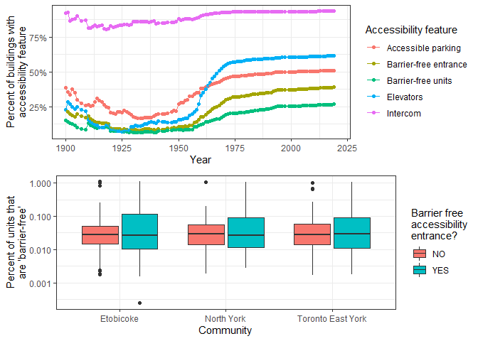
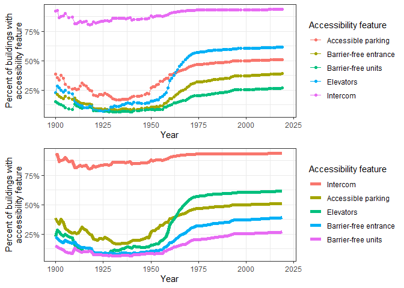
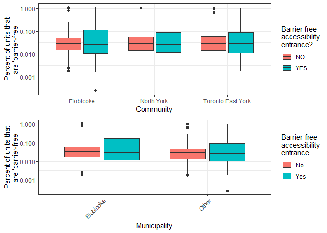

Mini Data-Analysis Deliverable 3
================
Shannon Edie

# Welcome to your last milestone in your mini data analysis project!

In Milestone 1, you explored your data and came up with research
questions. In Milestone 2, you obtained some results by making summary
tables and graphs.

In this (3rd) milestone, you’ll be sharpening some of the results you
obtained from your previous milestone by:

-   Manipulating special data types in R: factors and/or dates and
    times.
-   Fitting a model object to your data, and extract a result.
-   Reading and writing data as separate files.

**NOTE**: The main purpose of the mini data analysis is to integrate
what you learn in class in an analysis. Although each milestone provides
a framework for you to conduct your analysis, it’s possible that you
might find the instructions too rigid for your data set. If this is the
case, you may deviate from the instructions – just make sure you’re
demonstrating a wide range of tools and techniques taught in this class.

## Instructions

**To complete this milestone**, edit [this very `.Rmd`
file](https://raw.githubusercontent.com/UBC-STAT/stat545.stat.ubc.ca/master/content/mini-project/mini-project-3.Rmd)
directly. Fill in the sections that are tagged with
`<!--- start your work here--->`.

**To submit this milestone**, make sure to knit this `.Rmd` file to an
`.md` file by changing the YAML output settings from
`output: html_document` to `output: github_document`. Commit and push
all of your work to your mini-analysis GitHub repository, and tag a
release on GitHub. Then, submit a link to your tagged release on canvas.

**Points**: This milestone is worth 40 points (compared to the usual 30
points): 30 for your analysis, and 10 for your entire mini-analysis
GitHub repository. Details follow.

**Research Questions**: In Milestone 2, you chose two research questions
to focus on. Wherever realistic, your work in this milestone should
relate to these research questions whenever we ask for justification
behind your work. In the case that some tasks in this milestone don’t
align well with one of your research questions, feel free to discuss
your results in the context of a different research question.

# Setup

Begin by loading your data and the tidyverse package below:

``` r
library(datateachr) # <- might contain the data you picked!
library(tidyverse)
```

    ## Warning: package 'tidyverse' was built under R version 4.1.1

``` r
library(gridExtra)
```

    ## Warning: package 'gridExtra' was built under R version 4.1.1

``` r
library(gt)
```

    ## Warning: package 'gt' was built under R version 4.1.1

From Milestone 2, you chose two research questions. What were they? Put
them here.

<!-------------------------- Start your work below ---------------------------->

1.  Is the accessibility of a unit associated with the ward in which the
    building exists?
2.  Have the accessibility features for apartment buildings improved
    over time?

``` r
# From the original:
accessibility <- apt_buildings %>%
  # There's also one apartment building in ward "YY"-- let's remove that building
  # Let's also filter out buildings built before the 1900s
  filter(ward!="YY") %>%
  # Let's define the wards in terms of the communities they are in
  mutate(community = ifelse(as.numeric(ward) %in% c(1:7, 11:13, 17),
                                "Etobicoke",
                         ifelse(as.numeric(ward) %in% c(14, 18:22, 27:32), 
                                "Toronto East York",
                         ifelse(as.numeric(ward) %in% c(8:10, 15:16, 23:26, 33:34),
                                "North York",
                         ifelse(as.numeric(ward) %in% c(35:44),
                                "Scarborough", ward
                                ))))) %>%
  # Now select only the variables I am interested in
  select(
    # Select accessibility variables
    barrier_free_accessibilty_entr, no_of_elevators, intercom,
    no_of_accessible_parking_spaces, no_barrier_free_accessible_units,
    
    # Select grouping variables
    ward, community, year_built, no_of_storeys, no_of_units
    ) %>%
  # Let's filter so we're only looking at data from the 20th century and on
  filter(year_built >= 1900) %>%
  # We can also look at high-rise status
  mutate(rise = cut(no_of_storeys, 
                           breaks = c(0,3,12,1000),
                           labels=c("small", "low-rise", "high-rise")))
```

<!----------------------------------------------------------------------------->

# Exercise 1: Special Data Types (10)

For this exercise, you’ll be choosing two of the three tasks below –
both tasks that you choose are worth 5 points each.

But first, tasks 1 and 2 below ask you to modify a plot you made in a
previous milestone. The plot you choose should involve plotting across
at least three groups (whether by facetting, or using an aesthetic like
colour). Place this plot below (you’re allowed to modify the plot if
you’d like). If you don’t have such a plot, you’ll need to make one.
Place the code for your plot below.

<!-------------------------- Start your work below ---------------------------->

``` r
accessibility.plot.data <- accessibility %>%
  # Create a numerical variable with t or more groups
  mutate(`Elevators`= ifelse(no_of_elevators==0 & no_of_storeys > 0, "No",
                      ifelse(no_of_storeys==0, "Not needed", "Yes")),
         `Accessible parking`=ifelse(no_of_accessible_parking_spaces==0, 
                                     "no", "yes"),
         `Barrier-free units` = ifelse(no_barrier_free_accessible_units > 0,
                                       "yes", "no")
         ) %>%
  # Rename the existing binary variables to be a little nicer
  rename(`Barrier-free entrance`=barrier_free_accessibilty_entr,
         Intercom=intercom) %>%
  group_by(year_built) %>%
  # Get counts of buildings saying yes/no per variable for each year
  # and within each community
  summarise_at(c("Barrier-free entrance", "Intercom", "Barrier-free units",
              "Accessible parking", "Elevators"),
            list("YES"=function(x){sum(toupper(x)=="YES", na.rm=T)},
                 "NO"=function(x){sum(toupper(x)=="NO", na.rm=T)},
                 "None"=function(x){sum(is.na(x), na.rm=T)})) %>%
  # Calculate cumulative sums throughout the years
  ungroup() %>% arrange(year_built) %>%
  mutate_at(names(.)[-c(1)], cumsum) %>%
  pivot_longer(names(.)[-c(1)], 
               names_to=c("variable", ".value"),
               names_pattern="(.*)_([^_]*$)") %>%
  mutate(percent_yes = YES / (YES + NO + None))


orig.1 <- ggplot(accessibility.plot.data) +
  geom_point(aes(x=year_built, y=percent_yes, col=variable)) +
  geom_line(aes(x=year_built, y=percent_yes, col=variable)) +
  xlim(c(1900,2020)) +
  xlab("Year") + ylab("Percent of buildings with\naccessibility feature") +
  scale_color_discrete(name="Accessibility feature") +
  theme_bw() +
  scale_y_continuous(labels = scales::percent)

orig.2 <- accessibility %>%
ggplot() +
  geom_boxplot(aes(x=community,
                   # Add 1 to allow for log-transform
                   y=(no_barrier_free_accessible_units+1)/no_of_units,
           fill=barrier_free_accessibilty_entr)) +
  theme_bw() +
  ylab("Percent of units that\nare 'barrier-free'") + xlab("Community") +
  scale_fill_discrete(name="Barrier free\naccessibility\nentrance?") +
  scale_y_log10()
  
grid.arrange(orig.1, orig.2)
```

    ## Warning: Removed 141 rows containing non-finite values (stat_boxplot).

<!-- -->

<!----------------------------------------------------------------------------->

Now, choose two of the following tasks.

1.  Produce a new plot that reorders a factor in your original plot,
    using the `forcats` package (3 points). Then, in a sentence or two,
    briefly explain why you chose this ordering (1 point here for
    demonstrating understanding of the reordering, and 1 point for
    demonstrating some justification for the reordering, which could be
    subtle or speculative.)

2.  Produce a new plot that groups some factor levels together into an
    “other” category (or something similar), using the `forcats` package
    (3 points). Then, in a sentence or two, briefly explain why you
    chose this grouping (1 point here for demonstrating understanding of
    the grouping, and 1 point for demonstrating some justification for
    the grouping, which could be subtle or speculative.)

<!-------------------------- Start your work below ---------------------------->

**Task Number**: 1

For this task, I reordered the colors factor labels indicating which
accessibility feature was which. I reordered the levels according to the
“percent yes” column, or the column which describes the percent of
buildings in any given year. I chose this reordering because this way
the legend aligned with the lines on the plot, making for better
readability. The new plot is on the bottom, while the old plot is on the
top.

``` r
new.1 <- ggplot(accessibility.plot.data) +
  geom_line(aes(x=year_built,
                y=percent_yes,
                col=fct_reorder(variable, -percent_yes)), lwd=2) +
  xlim(c(1900,2020)) +
  xlab("Year") + ylab("Percent of buildings with\naccessibility feature") +
  scale_color_discrete(name="Accessibility feature") +
  theme_bw() +
  scale_y_continuous(labels = scales::percent)

grid.arrange(orig.1, new.1)
```

<!-- -->

<!----------------------------------------------------------------------------->
<!-------------------------- Start your work below ---------------------------->

**Task Number**: 2

For the second task, I used the second plot that I generated in
Milestone 2. I regrouped according to whether or not each ward was in
the municipality of Etobicoke, which is a bit different than the
community of Etobicoke. This regrouping could be useful to indicate if
there are municipal differences in accessibility particularly for
Etobicoke versus its surrounding communities. The new plot is on the
bottom, while the original plot is on the top.

``` r
new.2 <- accessibility %>%
  filter(!is.na(barrier_free_accessibilty_entr)) %>%
  mutate(percent.free = (no_barrier_free_accessible_units+1)/no_of_units) %>%
ggplot() +
  geom_boxplot(aes(x=fct_collapse(as.factor(ward), 
                                  Etobicoke=sprintf("%02d", c(1:6)),
                                  `Other`=sprintf("%02d", c(7:25))),
                   # Add 1 to allow for log-transform
                   y=percent.free,
                   fill=fct_recode(barrier_free_accessibilty_entr,
                                   No="NO", Yes="YES"))) +
  theme_bw() +
  # rotate x axis labels so we can better see them
  theme(axis.text.x = element_text(angle = 45, hjust = 1, vjust = 1)) +
  ylab("Percent of units that\nare 'barrier-free'") + xlab("Municipality") +
  scale_fill_discrete(name="Barrier-free\naccessibility\nentrance") +
  scale_y_log10()

grid.arrange(orig.2, new.2)
```

    ## Warning: Removed 141 rows containing non-finite values (stat_boxplot).

    ## Warning: Removed 70 rows containing non-finite values (stat_boxplot).

<!-- -->

<!----------------------------------------------------------------------------->

# Exercise 2: Modelling

## 2.0 (no points)

Pick a research question, and pick a variable of interest (we’ll call it
“Y”) that’s relevant to the research question. Indicate these.

<!-------------------------- Start your work below ---------------------------->

**Research Question**: The counts of buildings with barrier-free
entrances is independent of the ward in which the building exists.

**Variable of interest**: Count of buildings with barrier-free entrances

<!----------------------------------------------------------------------------->

## 2.1 (5 points)

Fit a model or run a hypothesis test that provides insight on this
variable with respect to the research question. Store the model object
as a variable, and print its output to screen. We’ll omit having to
justify your choice, because we don’t expect you to know about model
specifics in STAT 545.

-   **Note**: It’s OK if you don’t know how these models/tests work.
    Here are some examples of things you can do here, but the sky’s the
    limit.

    -   You could fit a model that makes predictions on Y using another
        variable, by using the `lm()` function.
    -   You could test whether the mean of Y equals 0 using `t.test()`,
        or maybe the mean across two groups are different using
        `t.test()`, or maybe the mean across multiple groups are
        different using `anova()` (you may have to pivot your data for
        the latter two).
    -   You could use `lm()` to test for significance of regression.

<!-------------------------- Start your work below ---------------------------->

I used a chi-squared test to test whether the community in which a
building existed was independent of whether the building had a
barrier-free entrance or not. I generated a counts table which counted
the number of buildings in each community that had the given number

``` r
chisq.data <- accessibility %>%
  # Generate a counts table
  count(community, barrier_free_accessibilty_entr) %>%
  # Wrap it so we have one column for yes / no for barrier-free 
  # accessibility entrance
  pivot_wider(id_cols = "community",
              names_from = barrier_free_accessibilty_entr,
              values_from = n, 
              values_fn = sum,
              values_fill = 0)
# Let's look at the table
chisq.data
```

    ## # A tibble: 3 x 4
    ##   community            NO   YES  `NA`
    ##   <chr>             <int> <int> <int>
    ## 1 Etobicoke          1197   691    48
    ## 2 North York          449   351    11
    ## 3 Toronto East York   376   293    12

``` r
# Now let's run the model
chisq.entr <- chisq.data %>%
  select(-community) %>%
  as.matrix() %>%
  chisq.test()
```

<!----------------------------------------------------------------------------->

## 2.2 (5 points)

Produce something relevant from your fitted model: either predictions on
Y, or a single value like a regression coefficient or a p-value.

-   Be sure to indicate in writing what you chose to produce.
-   Your code should either output a tibble (in which case you should
    indicate the column that contains the thing you’re looking for), or
    the thing you’re looking for itself.
-   Obtain your results using the `broom` package if possible. If your
    model is not compatible with the broom function you’re needing, then
    you can obtain your results by some other means, but first indicate
    which broom function is not compatible.

<!-------------------------- Start your work below ---------------------------->

To look at the results of the test, I used the `glance` function from
the `broom` package. I found a summary of the data as shown below. The
p-value for this test was 0.000195, indicating that there was a
significant dependency between community and the number of buildings
with barrier-free entrances.

Note that we cannot make causal conclusions here – it could be that the
buildings in one of these neighborhoods were built much earlier. As we
can see from the Task 1 plot, there is also a substantial relationship
between year built and the probability of having a barrier-free
entrance.

``` r
broom::glance(chisq.entr)
```

    ## # A tibble: 1 x 4
    ##   statistic  p.value parameter method                    
    ##       <dbl>    <dbl>     <int> <chr>                     
    ## 1      22.1 0.000195         4 Pearson's Chi-squared test

<!----------------------------------------------------------------------------->

# Exercise 3: Reading and writing data

Get set up for this exercise by making a folder called `output` in the
top level of your project folder / repository. You’ll be saving things
there.

## 3.1 (5 points)

Take a summary table that you made from Milestone 2 (Exercise 1.2), and
write it as a csv file in your `output` folder. Use the `here::here()`
function.

-   **Robustness criteria**: You should be able to move your Mini
    Project repository / project folder to some other location on your
    computer, or move this very Rmd file to another location within your
    project repository / folder, and your code should still work.
-   **Reproducibility criteria**: You should be able to delete the csv
    file, and remake it simply by knitting this Rmd file.

<!-------------------------- Start your work below ---------------------------->

I selected the summary table from Milestone 2 that generated counts of
yes/no responses for each of my accessibility variables of interest,
grouped by community.

``` r
# First re-generate the table using the same code from milestone_2.Rmd
table.data <- accessibility %>%
  mutate(`Elevators`= ifelse(no_of_elevators==0 & no_of_storeys > 0, "No",
                      ifelse(no_of_storeys==0, "Yes", "Yes")),
         `Accessible parking`=ifelse(no_of_accessible_parking_spaces==0, "no", "yes"))%>%
  # Rename the existing binary variables to be a little nicer
  rename(`Barrier-free entrance`=barrier_free_accessibilty_entr,
         Intercom=intercom) %>%
  select(community, ward, Elevators, `Accessible parking`, `Barrier-free entrance`, Intercom) %>%
  group_by(community) %>%
  pivot_longer(cols=Elevators:Intercom) %>%
  # Get counts for each of the yes/no safety features within each community
  count(name, value) %>%
  # Let's also make the YES/NO/NA labels lowercase
  mutate(value=tolower(value)) %>%
  group_by(community, name) %>%
  # Pivot so it's in a table shape
  pivot_wider(id_cols = c("community"), names_from = c(name, value), values_from = n)


head(table.data)
```

    ## # A tibble: 3 x 13
    ## # Groups:   community [3]
    ##   community         `Accessible par~ `Accessible par~ `Accessible par~ `Barrier-free e~
    ##   <chr>                        <int>            <int>            <int>            <int>
    ## 1 Etobicoke                      913              952               71             1197
    ## 2 North York                     369              424               18              449
    ## 3 Toronto East York              286              373               22              376
    ## # ... with 8 more variables: Barrier-free entrance_yes <int>,
    ## #   Barrier-free entrance_NA <int>, Elevators_no <int>, Elevators_yes <int>,
    ## #   Elevators_NA <int>, Intercom_no <int>, Intercom_yes <int>,
    ## #   Intercom_NA <int>

I used the `write_csv` function from the `tidyverse` universe to write
the data frame to a csv file. I used the `here::here` function to
indicate the location of this csv file. Using the `here::here` function
ensures the robustness of this command, and using the `write_csv`
function is for the reproducibility.

``` r
# First I had to create the output folder. 
# This is now commented out for politeness to other users of this code.

#if(!dir.exists(here::here("output"))){dir.create(here::here("output"))}

# Write as a csv file
write_csv(table.data, here::here("output", "summary_exercise1_2.csv"))
```

<!----------------------------------------------------------------------------->

## 3.2 (5 points)

Write your model object from Exercise 2 to an R binary file (an RDS),
and load it again. Be sure to save the binary file in your `output`
folder. Use the functions `saveRDS()` and `readRDS()`.

-   The same robustness and reproducibility criteria as in 3.1 apply
    here.

<!-------------------------- Start your work below ---------------------------->

I used the `here::here` function for robustness and the `saveRDS` and
`readRDS` functions for reproducibility.

``` r
# Save an object to a file
saveRDS(chisq.entr, here::here("output", "chisq_entrance_model.rds"))

# Re-load the object
chisq.entr.2 <- readRDS(here::here("output", "chisq_entrance_model.rds"))
# Now let's look at what we've got!
chisq.entr.2
```

    ## 
    ##  Pearson's Chi-squared test
    ## 
    ## data:  .
    ## X-squared = 22.056, df = 4, p-value = 0.0001954

<!----------------------------------------------------------------------------->

# Tidy Repository

Now that this is your last milestone, your entire project repository
should be organized. Here are the criteria we’re looking for.

## Main README (3 points)

There should be a file named `README.md` at the top level of your
repository. Its contents should automatically appear when you visit the
repository on GitHub.

Minimum contents of the README file:

-   In a sentence or two, explains what this repository is, so that
    future-you or someone else stumbling on your repository can be
    oriented to the repository.
-   In a sentence or two (or more??), briefly explains how to engage
    with the repository. You can assume the person reading knows the
    material from STAT 545A. Basically, if a visitor to your repository
    wants to explore your project, what should they know?

Once you get in the habit of making README files, and seeing more README
files in other projects, you’ll wonder how you ever got by without them!
They are tremendously helpful.

## File and Folder structure (3 points)

You should have at least four folders in the top level of your
repository: one for each milestone, and one output folder. If there are
any other folders, these are explained in the main README.

Each milestone document is contained in its respective folder, and
nowhere else.

Every level-1 folder (that is, the ones stored in the top level, like
“Milestone1” and “output”) has a `README` file, explaining in a sentence
or two what is in the folder, in plain language (it’s enough to say
something like “This folder contains the source for Milestone 1”).

## Output (2 points)

All output is recent and relevant:

-   All Rmd files have been `knit`ted to their output, and all data
    files saved from Exercise 3 above appear in the `output` folder.
-   All of these output files are up-to-date – that is, they haven’t
    fallen behind after the source (Rmd) files have been updated.
-   There should be no relic output files. For example, if you were
    knitting an Rmd to html, but then changed the output to be only a
    markdown file, then the html file is a relic and should be deleted.

Our recommendation: delete all output files, and re-knit each
milestone’s Rmd file, so that everything is up to date and relevant.

PS: there’s a way where you can run all project code using a single
command, instead of clicking “knit” three times. More on this in STAT
545B!

## Error-free code (1 point)

This Milestone 3 document knits error-free. (We’ve already graded this
aspect for Milestone 1 and 2)

## Tagged release (1 point)

You’ve tagged a release for Milestone 3. (We’ve already graded this
aspect for Milestone 1 and 2)
